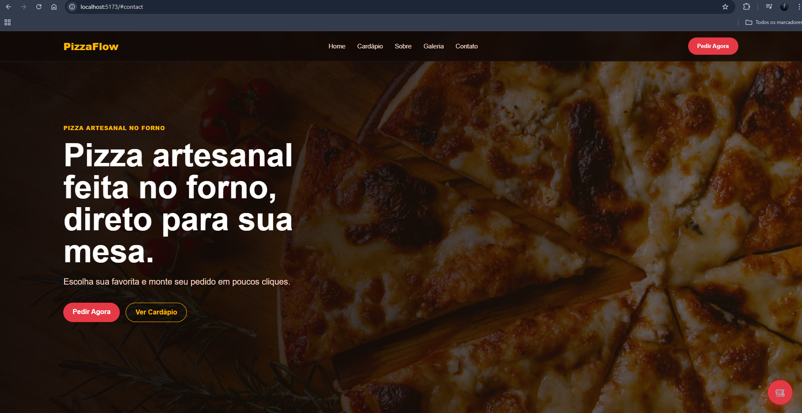
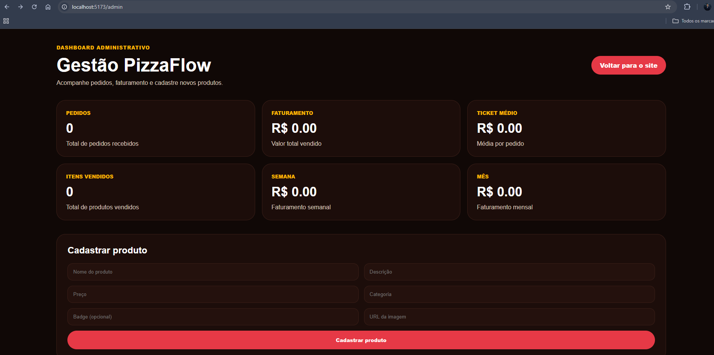

# 🍕 PizzaFlow

Sistema fullstack de pedidos para pizzarias — cardápio digital com carrinho, integração WhatsApp e painel administrativo com dashboard de métricas.

> Projeto desenvolvido para portfólio fullstack. Aberto a freelas e oportunidades.

---

## 🔗 Links

| | |
|---|---|
| 🌐 **Site ao vivo** | [pizzaflow-fullstack.vercel.app](https://pizzaflow-fullstack.vercel.app) |
| 🔐 **Painel Admin** | [pizzaflow-fullstack.vercel.app/admin](https://pizzaflow-fullstack.vercel.app/admin) |
| ⚙️ **API** | [pizzaflow-api.onrender.com](https://pizzaflow-api.onrender.com) |

---

## ✨ Funcionalidades

### Cliente
- 📋 Cardápio digital com filtro por categorias (Tradicional, Especial, Doce, Promoção, Bebidas)
- 🛒 Carrinho lateral com controle de quantidade e remoção de itens
- 💬 Finalização de pedido direto pelo WhatsApp com resumo formatado
- 📱 Layout totalmente responsivo para mobile e desktop
- 🔔 Feedback visual com toasts e loading states

### Painel Administrativo (`/admin`)
- 🔐 Acesso restrito por senha
- ➕ Cadastro de novos produtos (nome, descrição, preço, categoria, imagem, badge)
- 🗑️ Remoção de produtos existentes
- 📊 Dashboard com métricas: pedidos, faturamento total, ticket médio, faturamento semanal e mensal

---

## 🛠 Stack

**Front-end**
- React 18 + Vite
- CSS puro (sem framework de UI)
- React Router DOM

**Back-end**
- Node.js + Express
- API REST
- Armazenamento em memória (array local)

**Deploy**
- Vercel (client)
- Render (server)

---

## 📸 Preview

### Cardápio + Carrinho


### Painel Administrativo


---

## ⚙️ Como rodar localmente

### Pré-requisitos
- Node.js 18+
- npm

### Instalação

```bash
# Clonar o repositório
git clone https://github.com/LuuckySilva/pizzaflow-fullstack.git
cd pizzaflow-fullstack
```

```bash
# Instalar e rodar o server
cd server
npm install
npm run dev
# API disponível em http://localhost:3001
```

```bash
# Em outro terminal — instalar e rodar o client
cd client
npm install
npm run dev
# App disponível em http://localhost:5173
```

### Variáveis de ambiente

Crie um arquivo `.env` na pasta `server/`:

```env
PORT=3001
ADMIN_PASSWORD=sua_senha_aqui
```

---

## 📡 Endpoints da API

| Método | Rota | Descrição |
|---|---|---|
| GET | `/api/pizzas` | Lista todos os produtos |
| POST | `/api/pizzas` | Cadastra novo produto |
| DELETE | `/api/pizzas/:id` | Remove produto por ID |
| GET | `/api/dashboard` | Retorna métricas do dashboard |

---

## 🗂 Estrutura do projeto

```
pizzaflow-fullstack/
├── client/
│   ├── src/
│   │   ├── pages/
│   │   │   ├── Home/
│   │   │   └── Admin/
│   │   ├── App.jsx
│   │   └── App.css
│   └── package.json
├── server/
│   ├── index.js
│   └── package.json
└── README.md
```

---

## 🚧 Próximas melhorias

- [ ] Banco de dados PostgreSQL para persistência real
- [ ] Autenticação JWT no painel admin
- [ ] Gestão de pedidos recebidos no painel
- [ ] Histórico de pedidos com status (recebido / em preparo / entregue)
- [ ] Notificação de novo pedido em tempo real (WebSocket)

---

## 👨‍💻 Autor

**Lucas Silva**

[](https://www.linkedin.com/in/olucas-silvaa/)
[](https://github.com/LuuckySilva)

---

> **Interessado em um sistema como esse para seu negócio?**  
> Me chame no LinkedIn ou WhatsApp — desenvolvo soluções personalizadas para restaurantes e pequenos comércios.

