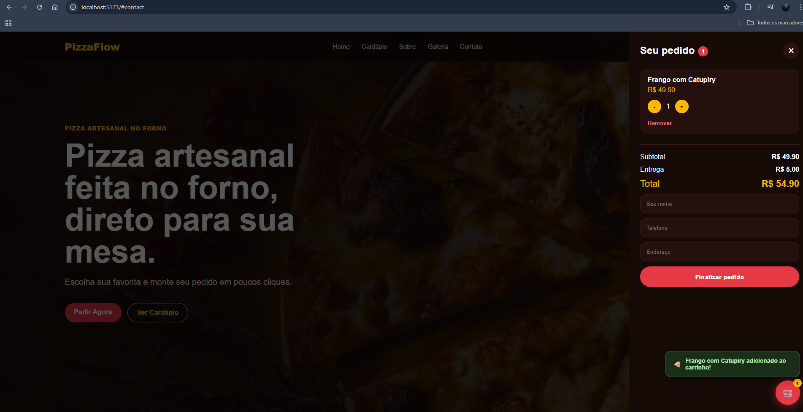

# 🍕 PizzaFlow — Sistema de Pedidos com Dashboard Admin

Sistema completo de pedidos online para pizzarias, com painel administrativo e métricas de vendas.

Projeto desenvolvido com foco em simular um produto real, incluindo experiência do cliente e gestão interna.

---

## 🚀 Demonstração

🔗 Front-end: http://localhost:5173  
🔗 API: http://localhost:3001/api/pizzas  

---


## 📸 Preview do Projeto

### 🏠 Landing Page


### 🛒 Carrinho de Pedidos


### ⚙️ Painel Administrativo


---

## 🧠 Funcionalidades

### 👤 Usuário (Front-end)
- Visualização do cardápio
- Filtro por categorias (Tradicional, Especial, Doce, Promoção, Bebidas)
- Carrinho lateral interativo
- Adição e remoção de produtos
- Cálculo automático de total
- Simulação de checkout
- Feedback visual com notificações (toast)

---

### 🛠️ Admin (Dashboard)
- Cadastro de novos produtos
- Remoção de produtos
- Visualização de produtos cadastrados
- Dashboard com métricas:
  - Total de pedidos
  - Faturamento total
  - Ticket médio
  - Itens vendidos
  - Faturamento semanal e mensal

---

### 🔌 Back-end (API)
- GET `/api/pizzas` → lista produtos  
- POST `/api/pizzas` → adiciona produto  
- DELETE `/api/pizzas/:id` → remove produto  
- GET `/api/dashboard` → métricas  

---

## 🧱 Tecnologias utilizadas

### Front-end
- React
- JavaScript
- CSS moderno (dark UI)
- Vite

### Back-end
- Node.js
- Express

### UX / UI
- React Hot Toast (feedback visual)
- Layout responsivo
- Carrinho estilo e-commerce

---

## 📂 Estrutura do Projeto


pizzaflow-fullstack/
├── client/
│ ├── src/
│ │ ├── pages/
│ │ │ └── Admin.jsx
│ │ ├── services/
│ │ ├── assets/
│ │ └── App.jsx
│
├── server/
│ ├── data/
│ │ └── pizzas.js
│ ├── index.js


---

## ▶️ Como rodar o projeto

### 1. Clonar o repositório

```bash
git clone https://github.com/LuuckySilva/pizzaflow-fullstack
2. Rodar o back-end
cd server
npm install
npm run dev

Servidor rodando em:

http://localhost:3001
3. Rodar o front-end
cd client
npm install
npm run dev

Aplicação rodando em:

http://localhost:5173
🎯 Objetivo do Projeto

Este projeto foi desenvolvido com foco em:

Simular um sistema real de pedidos
Aplicar conceitos de front-end e back-end
Criar um portfólio forte para vagas de desenvolvedor
Demonstrar capacidade de construir soluções completas
📈 Próximas melhorias
Autenticação no painel admin 🔒
Integração com banco de dados (PostgreSQL ou MongoDB)
Sistema de pedidos real (persistência)
Integração com WhatsApp API
Deploy completo (Vercel + Render)
👨‍💻 Autor

Lucas Silva

🔗 LinkedIn: https://www.linkedin.com/in/olucas-silvaa/

🔗 GitHub: https://github.com/LuuckySilva

⭐ Feedback

Sugestões e feedbacks são bem-vindos!


---

# ⚠️ IMPORTANTE (VOCÊ PRECISA FAZER)

## Criar pasta de imagens

📁 dentro do projeto:


/prints


Salvar como:


home.png
carrinho.png
admin.png


---

